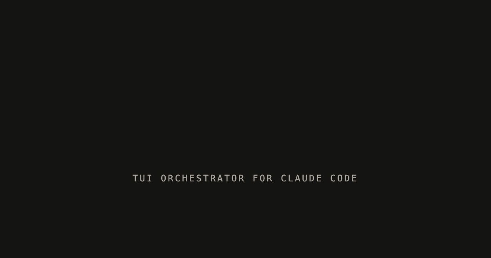

<p align="center">
  
</p>

<p align="center">
  <strong>A TUI orchestrator for Claude Code.</strong><br/>
  Conductor-shaped 5-pane terminal app: many sessions in flight, one place to drive them.
</p>

<p align="center">
  <em>Codename — will be renamed before any public release.</em>
</p>

---

## What it is

kobe is a terminal UI that runs multiple Claude Code sessions in parallel, each in its own git
worktree. The layout copies Conductor's grammar (sidebar of tasks, workspace pane with a chat
tab and per-file tabs, files tree, terminal, status bar) but the engine and theming follow Claude
Code's own conventions so a kobe session feels like a Claude Code session — not a third-party
shell wrapping it.

## Stack

**TypeScript** + **[`@opentui/core`](https://github.com/sst/opentui) / `@opentui/solid`** + **Solid.js** + **Bun**.
Tests via vitest + PTY-driven behavior tests. Lint via biome. Engine spawns the `claude` CLI as a
subprocess and parses `--output-format stream-json`.

## Quick start

```bash
bun install
bun run dev          # boots the 5-pane TUI
bun run test         # unit + type tests
bun run test:behavior  # PTY-driven; spawns kobe as a real binary
```

Tasks live at `~/.kobe/tasks.json`; per-task git worktrees live at `<repo>/.kobe/worktrees/<task-id>/`.

Current direction, what just shipped, and what's next live in [`HANDOFF.md`](./HANDOFF.md).
