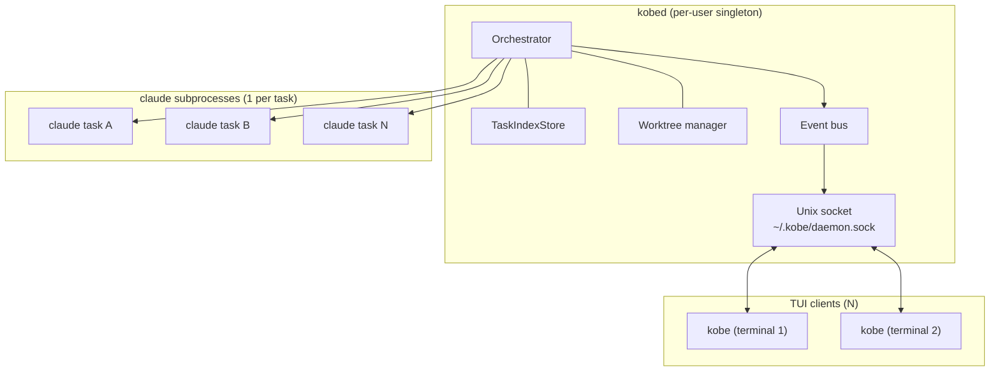
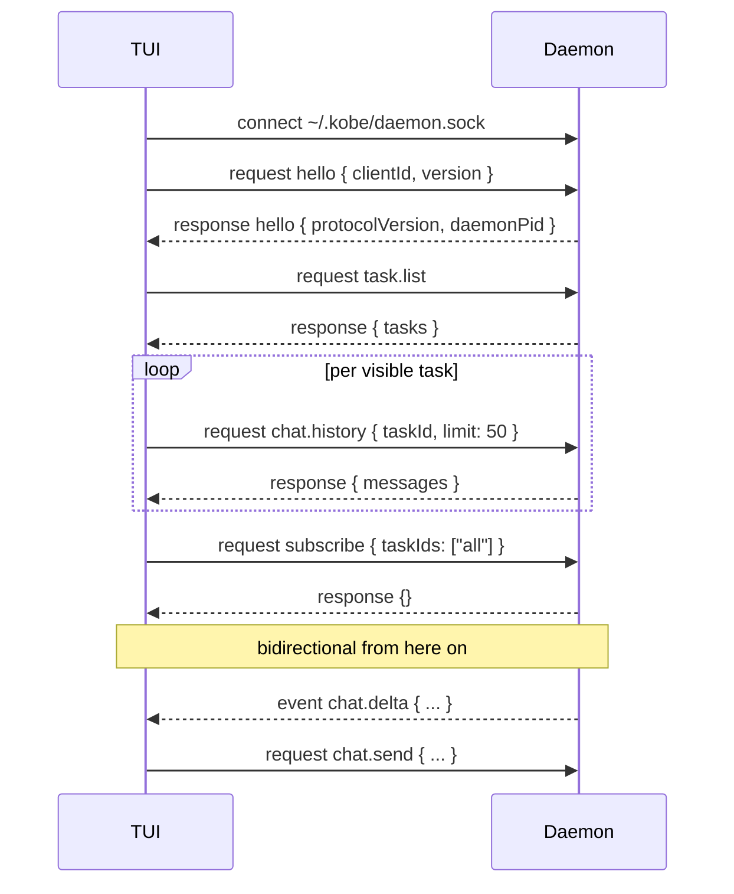

# Daemon — split kobe into `kobed` + thin TUI client

> Design doc. Not implemented yet. Tracks the decision shape so a
> future agent picks up Wave 1 with full context. Linear epic:
> [KOB-35](https://linear.app/codesfox/issue/KOB-35/daemon-split-kobed-thin-tui-client-multi-attach-per-user).

---

## 1. Why

Today kobe is one Bun process: TUI (Solid + opentui) + Orchestrator +
spawned `claude` subprocesses + worktree manager. Closing the TUI
(Ctrl+C, accidental terminal close, SSH drop) kills every running
`claude` subprocess. With 10+ in-flight chats this is brutal — even
with session-resume on disk you have to manually re-prompt every tab
to "continue".

Goal: TUI lifecycle is independent of engine lifecycle. Close the TUI,
chats keep streaming. Reopen the TUI, every chat is right where you
left it.

Secondary win: faster TUI iteration (hot-reload UI without nuking
active sessions), and multi-attach (two terminals, same daemon,
synchronised view).

---

## 2. Decisions (locked 2026-05-10)

| | Decision |
|---|---|
| Daemon scope | **Per-user** singleton — one `kobed` owns every repo's tasks. Not per-repo. |
| Lifecycle | **Explicit** `kobed start` / `kobed stop` / `kobed status`. No auto-spawn from TUI. Hard-cut: TUI errors out with `kobe: no daemon (run \`kobed start\`)` if the socket is missing. |
| Multi-attach | **Yes.** N TUIs can attach to one daemon. State (tasks, chat history) is broadcast to all attached clients. UI-local state (cursor, focus, composer draft) stays per-client. |
| Wire protocol | **JSON-lines over unix socket.** Custom `{type, id?, payload}` envelope. No LSP, no gRPC. Re-uses the pattern from [`orchestrator/bridge/server.ts`](../../packages/kobe/src/orchestrator/bridge/server.ts) but bidirectional. |
| Attach-time sync | **Snapshot + tail.** Daemon sends task list + last N (50?) chat messages per task on attach. Older history loads lazily on scroll. No full-history replay. |

---

## 3. Architecture



Closing `tui1` does not touch the daemon, the orchestrator, or any
`claude` subprocess.

---

## 4. State partition

| State | Owner | Why |
|---|---|---|
| Task list, status, archived/pinned flags | daemon | Survives TUI close. |
| Chat history (per task) | daemon (on disk, `.kobe/sessions/`) | Same as today — daemon just keeps reading/writing. |
| `claude` subprocess handles | daemon | The whole point. |
| Worktree paths, git HEADs | daemon | Same as today. |
| Bridge MCP server | daemon | Already a per-process socket; relocate inside `kobed`. |
| Theme, keybindings, settings | TUI-local (read from disk) | Per-user/per-machine UI prefs, not shared state. |
| Active tab, cursor index, focused pane | TUI-local | Two clients should be able to look at different tasks. |
| Composer draft (typed-but-unsent text) | TUI-local | "What I'm typing" is mine, not shared. Sent message broadcasts. |
| Sidebar scroll position, expand/collapse | TUI-local | View state. |

Litmus test: *if I close terminal 1 and open terminal 2, should the
state survive?* Yes → daemon. No → TUI-local.

---

## 5. Wire protocol sketch

Newline-delimited JSON. Each frame:

```json
{ "type": "request"  | "response" | "event",
  "id":   "<uuid>",                     // request/response correlation
  "name": "task.spawn" | "chat.send" | ...,
  "payload": { ... } }
```

### Request / response (TUI → daemon → TUI)
- `task.list` → `{ tasks: Task[] }`
- `task.spawn` `{ repo, title, ... }` → `{ taskId }`
- `task.archive` `{ taskId, archived }` → `{}`
- `task.rename` `{ taskId, title }` → `{}`
- `task.delete` `{ taskId }` → `{}`
- `chat.history` `{ taskId, before?: messageId, limit }` → `{ messages }`
- `chat.send` `{ taskId, text }` → `{ messageId }` (tail of stream arrives via events)

### Push events (daemon → all attached TUIs)
- `task.created` `{ task }`
- `task.updated` `{ taskId, patch }`
- `task.deleted` `{ taskId }`
- `chat.delta` `{ taskId, messageId, delta }` (streaming token chunks)
- `chat.complete` `{ taskId, messageId }`
- `engine.status` `{ taskId, status: "running" | "offline" | "error" }`

Event ordering: monotonically increasing `seq` per event so a client
that briefly disconnects and reattaches can request "events since
seq=N" — but **v1 just resyncs from snapshot on reattach**; the seq
infrastructure goes in once a flake actually shows up.

---

## 6. Attach flow



Subscribe is "all tasks" by default — broadcast cost is small and the
TUI may show any task at any time.

---

## 7. Lifecycle UX

```bash
$ kobed start            # binds ~/.kobe/daemon.sock, writes pidfile
$ kobed status           # prints pid, uptime, attached clients, task count
$ kobed stop             # graceful: tells claude subprocesses to flush, then exits
$ kobed restart          # stop + start

$ kobe                   # opens TUI, attaches to daemon
$ kobe                   # second terminal, second TUI, same daemon
```

If `kobe` runs and the socket is missing:

```
$ kobe
kobe: no daemon running. start it with:
  kobed start
```

Hard-cut. No auto-spawn. Two reasons:
- Auto-spawn races: two TUIs starting in parallel both try to spawn,
  one wins, the other ignores its own daemon.
- Clarity: `kobed` is a real process the user owns. `kobed status`
  is the answer to "what's happening?". Hidden auto-spawn hides that.

---

## 8. Crash recovery / engine-offline UX

If `kobed` dies (OOM, panic, kill -9):
- All `claude` subprocesses die (they're children).
- TUI's socket connection dies → TUI shows a banner: "daemon offline — `kobed start` to resume".
- After `kobed start`, TUI reconnects automatically. Task list comes
  back from disk. Each task's status is now `engine_offline`.
- Pressing `r` on an offline task triggers a session resume (already
  shipped in `src/tui/component/resume-dialog.tsx`).

**Required for daemon v1:** orchestrator must persist task metadata
(status, last activity, pinned, archived) to disk on every mutation,
not only on graceful shutdown. Chat / session JSONL is already
persistent.

Not in v1: auto-resume every task on daemon restart. User-driven
resume per task via `r` is fine for the first cut.

---

## 9. Phased implementation

| Wave | Title | Scope |
|---|---|---|
| **D0** | Core extract | Move `Orchestrator`, `TaskIndexStore`, worktree manager, bridge server out of TUI imports. Define a `KobeCore` boundary that knows nothing about Solid / opentui. No behavioural change — kobe still runs as one process, but `KobeCore` is now a self-contained module. |
| **D1** | Wire protocol + transport | Implement the JSON-line socket server (server-side push + request/response). Reuse [`orchestrator/bridge/server.ts`](../../packages/kobe/src/orchestrator/bridge/server.ts) shape. Build a typed client (`packages/kobe/src/client/`). Both still in-process for now — TUI talks to a "loopback" client that calls the server via the socket inside the same process. Validates the protocol end-to-end. |
| **D2** | `kobed` binary | Add `kobed` entry point (`packages/kobe/src/bin/kobed.ts`). Pidfile, signal handling, `kobed start/stop/status/restart`. Default socket: `$XDG_RUNTIME_DIR/kobe.sock` → fallback `~/.kobe/daemon.sock`. TUI now mandatorily talks over the socket; the in-process loopback from D1 is removed. Hard-cut error if no daemon. |
| **D3** | Multi-attach broadcast | Track all attached clients in the daemon. Broadcast events to all of them. Add the `engine_offline` status + reconnect banner to the TUI. Verify: open two terminals, send a message in one, see it stream in both. |
| **D4** (deferred) | Resilience polish | Event seq + replay-since-seq, daemon-side per-client backpressure, socket auth token in path, `kobed status --json`, structured logging to `~/.kobe/logs/`. Punt until D3 ships and shows what actually flakes. |

D0 → D3 is the MVP. Each wave is its own KOB issue under the epic.

---

## 10. Out of scope (v1)

- Daemon survives `kobed` itself dying — no, claude subprocesses die
  with their parent (Unix). Surviving daemon restart requires PID
  inheritance tricks (systemd fd-passing or similar) that aren't
  worth the complexity yet.
- Cross-machine attach (TUI on laptop A, daemon on desktop B). Unix
  socket only. Tailscale/SSH port-forward would work today; native
  remote attach can come later.
- Permission model. `~/.kobe/daemon.sock` is mode `0600` and that's
  the auth — single-user assumption. Multi-user shared host is not
  the target.
- TUI hot-reload. Once the daemon split lands, hot-reloading just the
  TUI module via `bun --hot` becomes feasible, but it's a separate
  follow-up — daemon split is the load-bearing prerequisite.

---

## 11. Open questions for the implementer

- **Where does `kobe mcp-bridge` live?** Today it speaks to the
  orchestrator in-process via the bridge socket. After D2 it should
  attach to `kobed` the same way the TUI does. Question: does the
  bridge become just another client of the daemon protocol, or does
  it keep its own socket? Probably the former — one protocol, one
  socket — but verify that the MCP tools' latency budget tolerates
  going through the same broadcast bus.
- **Composer draft persistence.** Decision said "TUI-local". But if
  Jackson types a long message and the TUI crashes, that draft is
  gone. Open question whether to checkpoint draft to disk per-TUI.
  Probably not in v1.
- **Settings sync.** Theme/keybinding files on disk are already
  shared (both TUIs read the same `~/.kobe/config.json`). What
  happens if TUI A flips theme and TUI B's already-rendered tree
  doesn't notice? Probably needs a `settings.changed` event from the
  daemon (or just a file-watcher in each TUI). Defer to D4.
